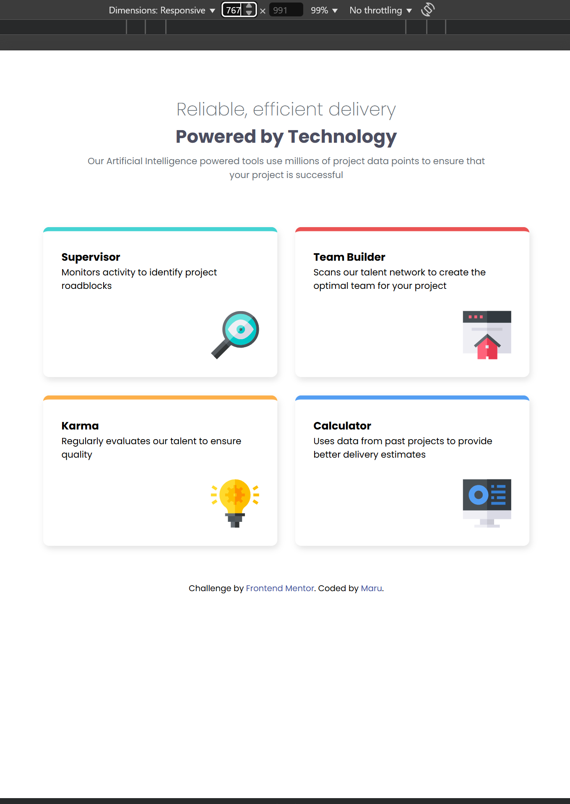
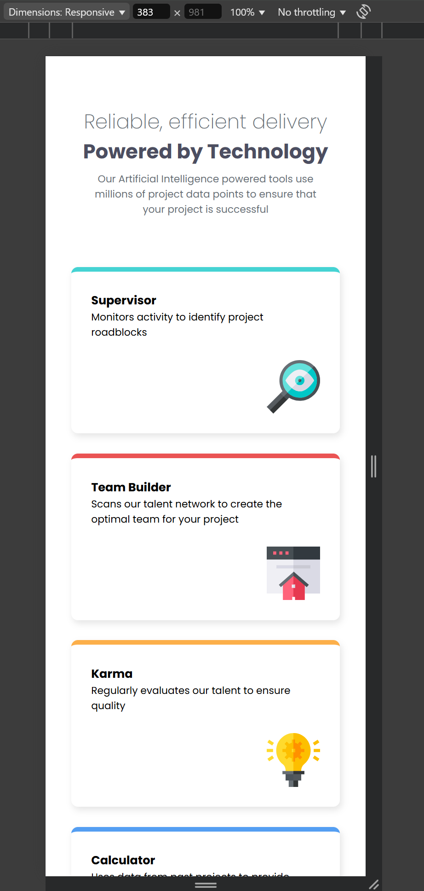

# Frontend Mentor - 4 枚のカード機能セクション

これは Frontend Mentor の Four card feature section です。Frontend Mentor は、現実的なプロジェクトを通してコーディングスキルを向上させるのに役立ちます。

## 概要

### 課題内容

ユーザーは以下のことができるようにすることが目標です：

デバイスの画面サイズに応じて、最適なレイアウトでサイトを閲覧できること

### スクリーンショット

### リンク

- Solution URL: [Add solution URL here](https://your-solution-url.com)

## 制作プロセス

### 使用技術

- セマンティックな HTML5 マークアップ
- CSS カスタムプロパティ
- Flexbox
- CSS Grid

## 制作者

- Website - [zerowater](https://www.your-site.com)
- Frontend Mentor - [@zerowater](https://www.frontendmentor.io/profile/zerowater4704)
- Twitter - [@jnyngxi188584](https://www.x.com/jnyngxi188584)
